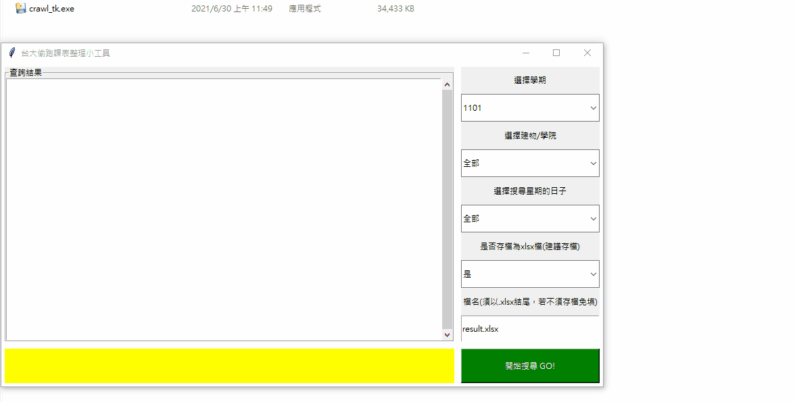
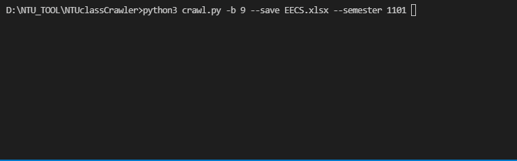
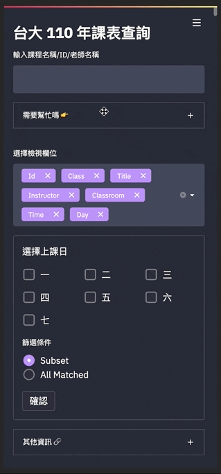

# NTU Class Crawler - 台大上課教室看板偷跑課表整理小工具

+ [NTU Class Crawler - 台大上課教室看板偷跑課表整理小工具](#ntu-class-crawler---台大上課教室看板偷跑課表整理小工具)
  + [Introduction](#introduction)
    + [Environment](#environment)
  + [How to Use](#how-to-use)
    + [GUI (Recommended)](#gui-recommended)
      + [Demo](#demo)
      + [1. Execute crawl_tk.exe directly (For Windows only)](#1-execute-crawl_tkexe-directly-for-windows-only)
      + [2. Create virtual env in Anaconda (For Windows/Mac/Linux)](#2-create-virtual-env-in-anaconda-for-windowsmaclinux)
    + [Terminal](#terminal)
      + [Optional Arguments](#optional-arguments)
      + [Examples](#examples)
    + [Local Wep App Deployment](#local-wep-app-deployment)
      + [Demo](#demo-1)
      + [Steps](#steps)
## Introduction

雖然[上課教室看板](http://gra206.aca.ntu.edu.tw/classrm/index.php/acarm/webcr-use1-new)會先偷跑下學期的一些課表，但因為系統設計的關係，查找其實不易。此程式會從[上課教室看板](http://gra206.aca.ntu.edu.tw/classrm/index.php/acarm/webcr-use1-new)上面爬取下學期的課表，並有條理地整理，因此可以在台大課程網更新前就先大致安排你的課表。雖然上面的資訊不完整，但若是想要事先安排課表的話還是相當方便。

This is a program that can crawl data of classes in next semester from
"classroom management system[上課教室看板](http://gra206.aca.ntu.edu.tw/classrm/index.php/acarm/webcr-use1-new)". With this program, you can arrange your classes before they come out at NTU online. While the information is not quite
complete on the website, it is still a useful and helpful tool if you want to
organize the curriculum for next semester in advance. 

你可以選擇使用圖形化介面，也可以直接在 terminal 中執行程式。最後，也有提供[簡易網頁版](https://share.streamlit.io/icheft/ntuclasscrawler/app.py)，可以讓你不用下載整份程式碼也能順利查找課表。

You can execute this program either in GUI or terminal. In addition, the website version of this program is served [here](https://share.streamlit.io/icheft/ntuclasscrawler/app.py) so that you won't have to clone and build from scratch.


### Environment
<a target="_blank" href="https://www.python.org/downloads/" title="Python version"></a> and the following libraries are required.


> 


## How to Use
### GUI (Recommended)
#### Demo


共有兩種方法可執行GUI程式。

There are two ways to use this program.

#### 1. Execute crawl_tk.exe directly (For Windows only)
> **此方法不用裝python也可以使用，直接執行就好很方便，推薦一般人使用**

直接下載```dist/crawl_tk.exe```並執行即可。

Download ```dist/crawl_tk.exe``` and execute it directly.

#### 2. Create virtual env in Anaconda (For Windows/Mac/Linux)
下載```crawl_tk.py```以及```requirements.txt```後，在 Anaconda 中建立 python 3.7 環境。並執行以下指令

After you download the files, create a virtual env with python=3.7 in Anaconda. Then, execute

```
pip install -r requirements.txt
python crawl_tk.py
```

### Terminal 



```
python3 crawl.py -b [building] --semester [semester]
```

#### Optional Arguments
```
optional arguments:
  -h, --help            show this help message and exit
  --semester SEMESTER   Select the semester you want to query
  --delay-time DELAY    Set the delay time between each request
  -p PAGE, --page PAGE  Assign the maximum page of each day.
  -s [SAVE], --save [SAVE]
                        Store the result. You can specify your filename.
                        Please use .xls or .xlsx as filename extension.
  -b {1,2,3,4,5,6,7,8,9,A,B,共同,普通,新生,綜合,博雅,%}
                        Specify the building you want to query.
                        If the building belongs to a college(ex:College of Electrical Engineering and Computer Science),
                        use the code of that college(ex:9),or simply type the name of the building(ex:博雅).
                        The percentage sign means search for all buildings.
                        The default is set as 9.
  --search-opt SEARCHOPT

                        Comma separated values to specify search options e.g. "Title=積體電路,Classroom=電二"
                        The available args include:
                            "Id": Curriculum Identity Number
                            "Class": The class number. If the course is taught by only one teacher, it is set to 00
                            "Title": Course title
                            "Instructor": Teacher name
                            "Classroom": Schedule Classroom 
                            "Time": The time of course

                        For example, if you type "--search-opt Title=積體電路,Classroom=電二", you may get the following result:
                                    Id Class        Title Instructor Classroom    Time
                        0  943U0010    00       積體電路測試        李建模     電二146  二2,3,4
                        1  921U9590    00  電力電子與積體電路控制        陳景然     電二225  二7,8,9
                        2  943U0120    00     射頻積體電路設計        陳怡然     電二104  三2,3,4
                        3  90140500    00       積體電路設計        盧奕璋     電二229  三7,8,9
                        4  942U0120    00     微波積體電路專題        林坤佑     電二101  四7,8,9


```
You can view all help message by typing
```
python3 crawl.py -h
```
#### Examples
> The default of the building is set as 9 (EECS). Remener to specify the -b option.

If you want to find the class whose name is 機器學習 in EECS and store the result to excel with filename <code>ML.xls</code>, you can use
```
python3 crawl.py --search-opt Title=機器學習 --save ML.xls -b 9 --semester 1101
```
or maybe you just want to find the classes teached in Bioresources and Agriculture college, and save it locally. You can just type
```
python3 crawl.py -b 6 --save Agri.xlsx --semester 1101
```
A common way of using this program is to download all of the courses into a xlsx file, and you can search directly in the xlsx file locally.
(It may take a while to execute it, since you want to go through all of the pages in the website.)
```
python3 crawl.py -b % --save course.xlsx --semester 1101
```

### Local Wep App Deployment

如果私服器（目前資料存放于台大資管系）有任何問題，或是你想在自己的電腦嘗試部署 [Web App](https://share.streamlit.io/icheft/ntuclasscrawler/app.py)，也可以利用以下作法在 local 端建置。

If the server held in the Department of Information Management fails or you want to deploy this web app locally, here are some tips to get you started.


#### Demo

👉🏽 [傳送門](https://share.streamlit.io/icheft/ntuclasscrawler/app.py) · [Web App Link](https://share.streamlit.io/icheft/ntuclasscrawler/app.py)


Responsive design as well 🙌🏾




#### Steps

<div style='font-size: 10px;'>
<p>
* 註：此部分僅為 local 端佈建使用。<br>
This part serves for people who want to deploy locally.
</p>
</div>


1. Make sure you've installed all the required packages in the desired environment (`pipenv` uses less resources than Anaconda)
2. Run the following command (default)

    ```sh
    python3 run_app.py --deploy
    ```
3. Some optional commands are listed below:

  ```
  optional arguments:
  -h, --help           show this help message and exit
  --semester SEMESTER  Select the semester you want to query
  --toCSV              Export csv file
  -d, --deploy         Deploy your site locally
  -f, --force          Override current course.xlsx file
  ```

  + If `deploy` command is not passed, the app won't be deployed.
  + Beware of the `--force` command as it may take **super long time** to crawl the data from scratch
  + If `course.xlsx` is not found at runtime, the program will automatically start crawling
4. If done successfully, you shall see something like this:

    ```
    course.xlsx file already exists
    Ready to deploy...

      You can now view your Streamlit app in your browser.

      Local URL: http://localhost:8501
      Network URL: http://192.168.2.235:8501
    ```
